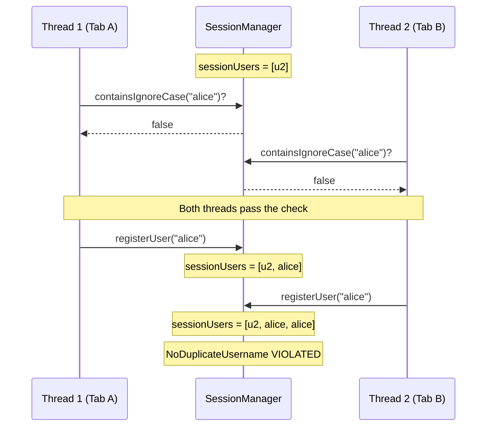
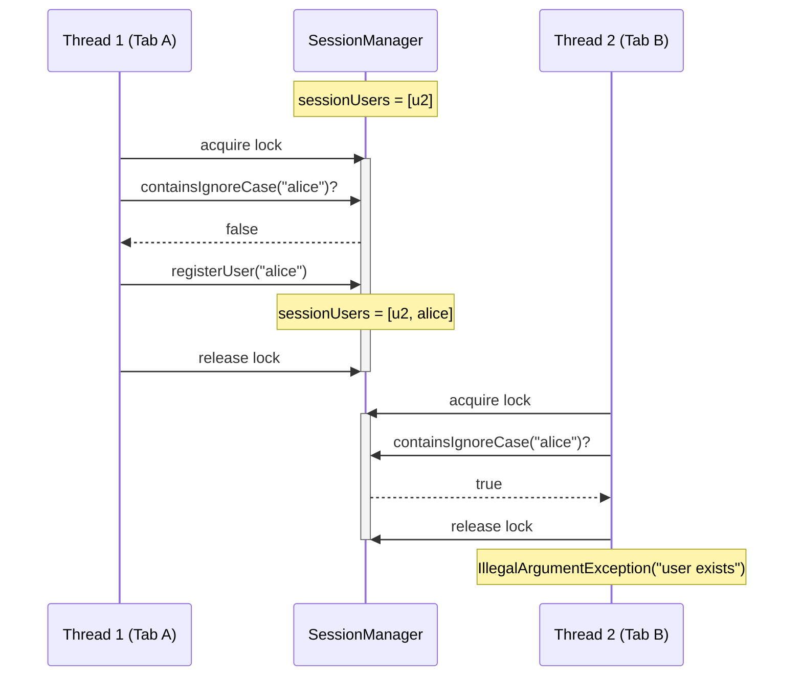
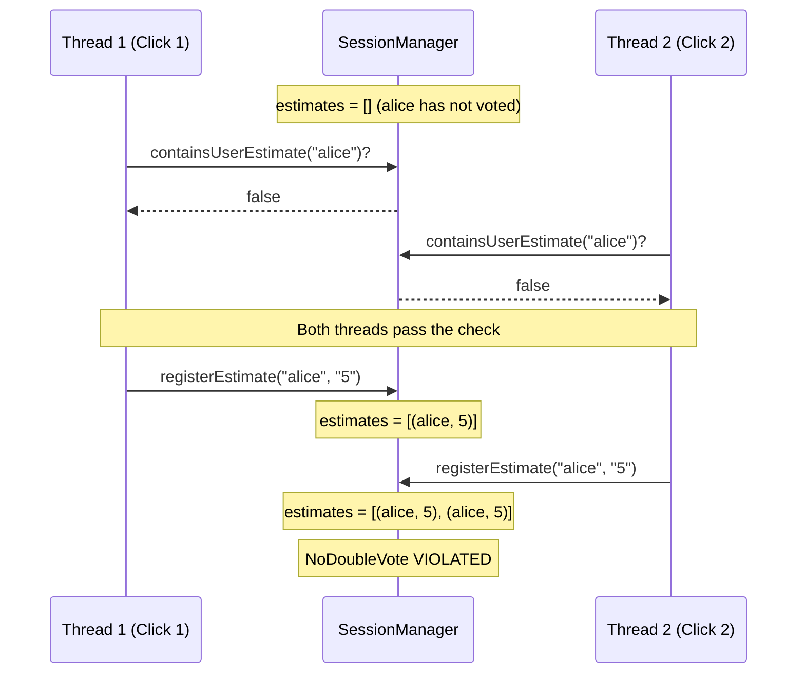
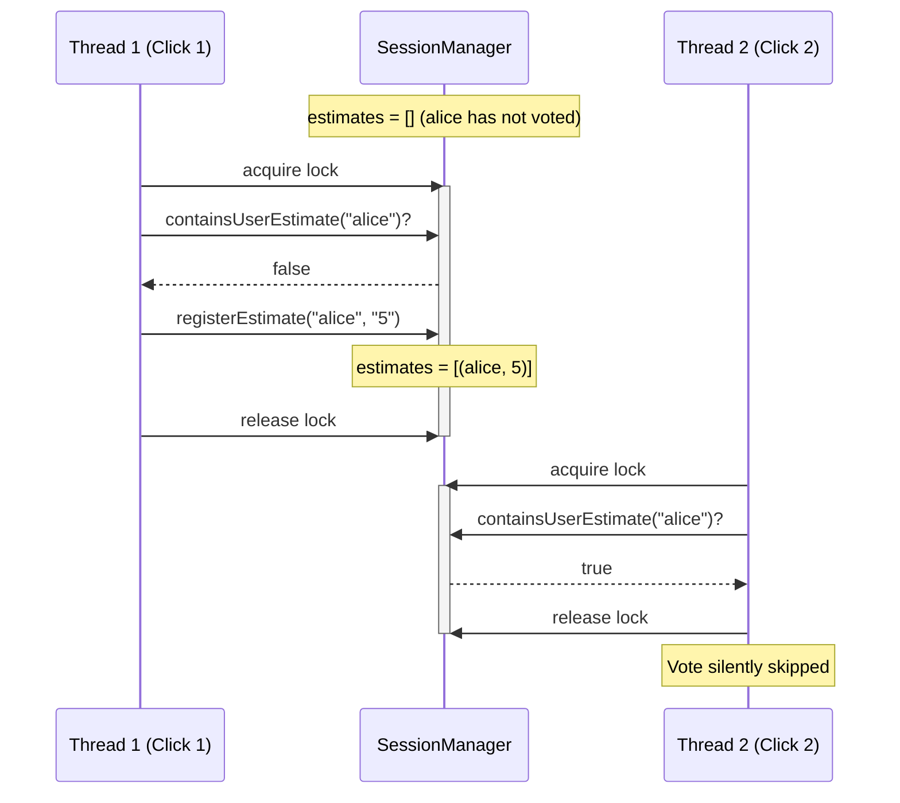
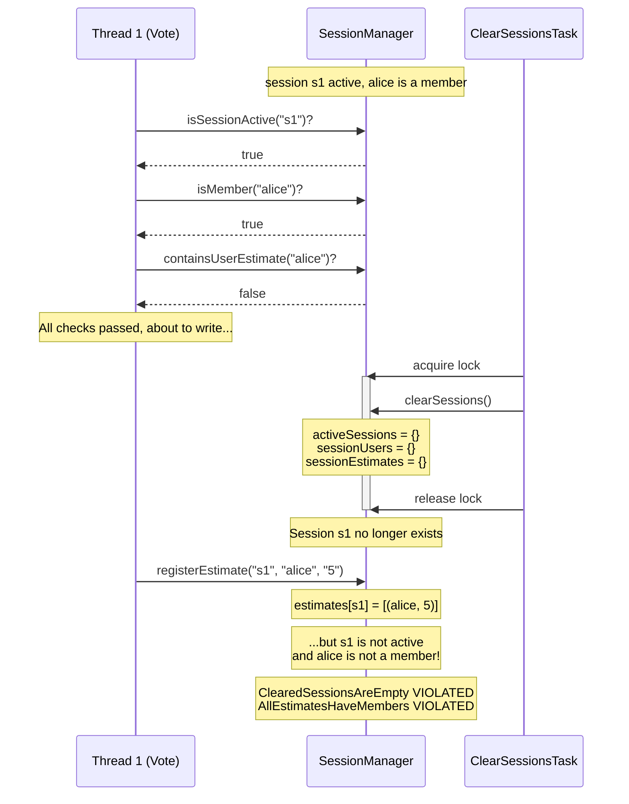
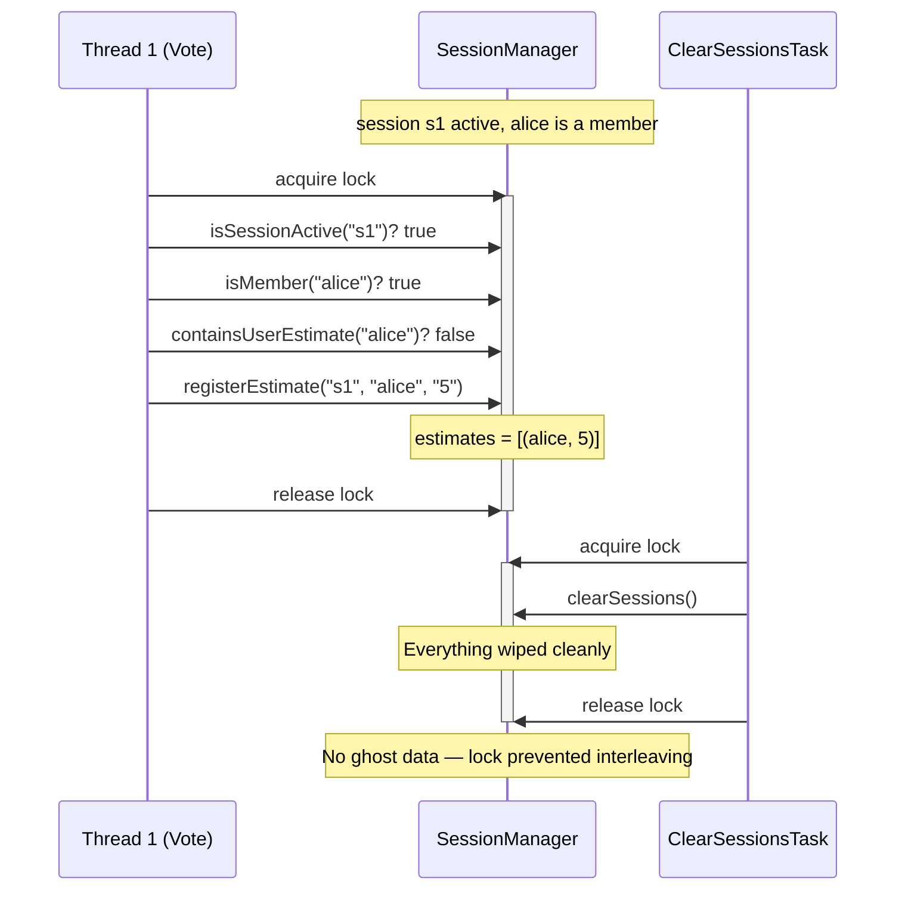

# Finding Concurrency Bugs in a Planning Poker App with TLA+

*How a 200-line formal spec found three classes of race conditions that tests missed*

---

## The Setup

I have a [planning poker](https://github.com/richashworth/planningpoker) web app — a Spring Boot backend with a React frontend, used for agile estimation sessions. Users create sessions, join with a username, vote on story points, and see results in real time via WebSockets.

All session state lives in memory, backed by Guava's `ListMultimap` and `synchronizedSet` wrappers. No database, no distributed state — just a single JVM. How hard could concurrency be?

## "Synchronized" Doesn't Mean "Safe"

The backend uses `Multimaps.synchronizedListMultimap` and `Collections.synchronizedSet` for thread safety. Each individual `put`, `get`, or `remove` is atomic. The code *looks* safe:

```java
// VoteController.java — simplified
if (!sessionManager.containsUserEstimate(sessionId, userName)) {
    sessionManager.registerEstimate(sessionId, userName, estimate);
}
```

But the check and the write are **two separate operations**. Between `containsUserEstimate` returning `false` and `registerEstimate` executing, another thread can do anything — including registering the same user's estimate.

This is a textbook TOCTOU (time-of-check-to-time-of-use) race. The synchronized wrapper protects each call individually, but the *gap between calls* is the vulnerability window.

I suspected there were bugs here. But suspecting and *proving* are different things. Unit tests can't systematically explore every interleaving. That's where TLA+ comes in.

## What is TLA+?

TLA+ is a formal specification language for modeling systems and exhaustively checking their properties. You describe:

- **State**: what variables the system has and their possible values
- **Actions**: what operations can change state, and under what conditions
- **Invariants**: what should *never* be true in any reachable state

Then TLC, the model checker, explores *every possible sequence of actions* from the initial state, checking every invariant at every step. If there's a way to reach a bad state, TLC finds it and gives you the exact step-by-step trace.

It's like having an impossibly thorough test suite that checks every interleaving — not just the ones you thought to write.

## Modeling the Planning Poker System

The spec models four variables:

| Variable | What it represents |
|----------|-------------------|
| `activeSessions` | Which sessions currently exist |
| `sessionUsers` | Who's in each session (a *sequence*, so duplicates are visible) |
| `sessionEstimates` | Votes cast (sequence of user-estimate pairs) |
| `threadState` | What each HTTP handler thread is currently doing |

The `threadState` variable is the key modeling insight. It represents the "intent" that a thread recorded during the Check phase of a TOCTOU operation. A thread in state `PendingVote(u1, s1, e1)` has passed all the guards — session exists, user is a member, hasn't voted yet — and is about to write the vote. But it hasn't written yet. And between those two moments, anything can happen.

### Splitting Check from Act

The real code has compound operations that aren't atomic. The spec models this by splitting each into two TLA+ actions:

```
JoinCheck(t, u, s):  "Thread t checks: is user u not yet in session s?"
                     Records intent in threadState.

JoinAct(t):          "Thread t appends user to session."
                     Does NOT re-check the guard.
```

TLC is free to schedule *any other action* between JoinCheck and JoinAct. Including another thread doing its own JoinCheck for the same user. This is exactly what a Spring Boot thread pool can do.

Actions that *are* properly synchronized in the code — like `Reset`, which uses a `synchronized(sessionManager)` block — are modeled as single atomic actions. The spec faithfully captures which operations are protected and which aren't.

## What TLC Found

With just **1 session, 2 users, 2 estimate values, and 2 threads**, TLC explored **35,530 distinct states** in under a second. It found three classes of bugs:

### Bug 1: Double-Join Race

Two browser tabs open, same username entered, join clicked at roughly the same time. The `containsIgnoreCase` check passes for both because neither has written yet.

**The bug** — no lock around the check-then-act:



**The fix** — `synchronized` makes check+write atomic:



**Impact**: Without the fix, the UI shows the same user twice in the participants list.

### Bug 2: Double-Vote Race

A user clicks the vote button and the request is slow. They click again. Both requests pass the `containsUserEstimate` check before either writes.

**The bug** — no lock around the check-then-act:



**The fix** — `synchronized` makes check+write atomic:



**Impact**: Without the fix, a user's estimate appears twice in the results, skewing displayed averages.

### Bug 3: Ghost Writes After Session Clear

The weekly `ClearSessionsTask` fires at midnight Sunday. It's `synchronized` on the SessionManager, but the vote operation doesn't acquire that lock. A thread that already passed its checks writes into a dead session.

**The bug** — cron and vote don't share a lock:



**The fix** — vote acquires the same lock as the cron:



**Impact**: Without the fix, orphaned data accumulates in the multimaps — a memory leak that persists until the next server restart.

## What This Teaches Us

### 1. Synchronized collections are not enough

Java's `Collections.synchronizedList/Set/Map` and Guava's `Multimaps.synchronizedListMultimap` protect individual operations. But most real logic involves *sequences* of operations — read-then-write, check-then-act — and the wrapper doesn't protect the sequence.

The fix is to either:
- Use explicit `synchronized` blocks around compound operations (like `Reset` already does)
- Use `ConcurrentHashMap.compute()` or similar atomic compound operations
- Design state so that single-operation mutations are sufficient

### 2. Tests can't find these bugs (practically)

The double-vote race requires two threads to interleave at a specific point. A test would need to use `CountDownLatch` or similar coordination to force the timing — and you'd need to *know the race exists* to write that test. You don't test for bugs you haven't imagined.

TLC doesn't need you to imagine the bug. It checks every interleaving, every ordering, every combination. The bug traces it produces are *existence proofs* — concrete sequences of events that violate your invariants.

### 3. Small models find big bugs

The spec uses **2 threads** and **1 session**. That's it. You might think you need to model 200 concurrent users to find concurrency bugs, but the TOCTOU pattern only needs 2 threads to manifest. TLC's exhaustive exploration means it *will* find the interleaving if it exists.

This is a general principle in formal methods: the bugs are in the logic, not the scale. A 2-thread model with exhaustive checking finds more bugs than a 200-thread model with random testing.

### 4. TLA+ shifts design decisions left

The most valuable moment to discover a concurrency bug is *before you write the code*. TLA+ can model a system design — the operations, the shared state, the synchronization boundaries — and find races before a single line of implementation exists.

For this planning poker app, the spec tells me exactly which operations need `synchronized` blocks and which are already safe. That's a design decision that should be made once and encoded in the architecture, not discovered through production incidents.

## Proposed Fixes

TLC doesn't just find bugs — the violation traces tell you exactly *what* to fix and *where*. Here's what the spec says needs to change, mapped back to the actual code.

### Fix 1: Synchronize the vote check-then-act

The race is in `VoteController.vote()` (line 47): the `containsUserEstimate` check and the `registerEstimate` write are two separate calls with no shared lock. The fix is the same pattern already used by `reset()` — wrap the compound operation in a `synchronized` block:

```java
// VoteController.java — before (buggy)
if (!CollectionUtils.containsUserEstimate(sessionManager.getResults(sessionId), userName)) {
    final Estimate estimate = new Estimate(userName, estimateValue);
    sessionManager.registerEstimate(sessionId, estimate);
}

// VoteController.java — after (fixed)
synchronized (sessionManager) {
    if (!CollectionUtils.containsUserEstimate(sessionManager.getResults(sessionId), userName)) {
        final Estimate estimate = new Estimate(userName, estimateValue);
        sessionManager.registerEstimate(sessionId, estimate);
    }
}
```

The `reset()` method in `GameController` already synchronizes on `sessionManager` (line 93). Using the same monitor means votes and resets can't interleave either.

### Fix 2: Synchronize the join check-then-act

Same pattern in `GameController.joinSession()` (line 38): the `containsIgnoreCase` check and `registerUser` write are unprotected. Wrap them:

```java
// GameController.java — before (buggy)
} else if (containsIgnoreCase(sessionManager.getSessionUsers(sessionId), userName)) {
    throw new IllegalArgumentException("user exists");
} else {
    sessionManager.registerUser(userName, sessionId);

// GameController.java — after (fixed)
synchronized (sessionManager) {
    if (containsIgnoreCase(sessionManager.getSessionUsers(sessionId), userName)) {
        throw new IllegalArgumentException("user exists");
    }
    sessionManager.registerUser(userName, sessionId);
}
```

### Fix 3: Synchronize logout

`GameController.leaveSession()` (line 65) calls `removeUser`, which does `sessionUsers.remove()` then `sessionEstimates.get().removeIf()` — two operations on two different collections. A concurrent vote could add an estimate between the user removal and the estimate cleanup. Wrap the compound operation:

```java
// GameController.java — after (fixed)
synchronized (sessionManager) {
    sessionManager.removeUser(userName, sessionId);
}
```

### Fix 4: Align clearSessions with other locks

`SessionManager.clearSessions()` (line 48) is `synchronized` on `this` (the SessionManager instance). The controller methods synchronize on `sessionManager` — which *is* the same object, so the monitors already align. But the membership validation in `validateSessionMembership()` is still unprotected. If a session is cleared between the validation check (line 109) and the subsequent operation, the operation proceeds on a dead session. Moving validation inside the synchronized blocks would close this gap.

### Impact to users

None — under normal usage. The fixes only affect what happens when two requests race, and in every case the "fixed" behaviour is what users already expect:

| Fix | Before (racy) | After (fixed) |
|-----|--------------|---------------|
| Double-join | Both requests succeed, username appears twice in participant list | Second request gets "user exists" error |
| Double-vote | Both votes recorded silently, user has two entries in results | Second vote silently ignored — same as the single-threaded case |
| Ghost writes | Orphaned data accumulates in server memory after the weekly cron | Cron cleanly wipes everything, no orphans |

The `synchronized` blocks do add minor lock contention — requests that would have executed concurrently now briefly serialize. But the critical sections are tiny (an in-memory collection check + a put), so the added latency is sub-millisecond. The burst messaging, which takes ~7.7 seconds per event, remains outside the lock and is the real bottleneck. A user clicking "vote" once, from one tab, experiences exactly the same thing as before.

### What *doesn't* need fixing

The spec also confirms that `reset()` is already correctly synchronized — it was the one operation where the original developer got the locking right. And `createSession()` is safe because it generates a fresh UUID that no other thread could be operating on.

### The bigger picture

All four fixes follow the same pattern: widen the `synchronized` block to cover the full check-then-act sequence. This is the insight TLA+ made concrete. The spec didn't just say "there's a race condition somewhere" — it produced the exact interleaving, the exact state that violated the invariant, and the exact pair of operations that needed to be atomic.

An alternative to per-operation locking would be to move the compound logic into `SessionManager` itself, where it could use private locks with finer granularity (per-session rather than global). That's a larger refactor but would reduce lock contention under load.

## Verifying the Fix

After applying the `synchronized` blocks, I updated the TLA+ spec to match: join, vote, and logout become single atomic actions instead of check/act pairs. ClearSessions shares the same lock, so it can't interleave mid-operation.

Running TLC on the fixed spec:

```
Model checking completed. No error has been found.
189 states generated, 34 distinct states found, 0 states left on queue.
The depth of the complete state graph search is 5.
```

The contrast tells the story:

| | Buggy | Fixed |
|---|---|---|
| Distinct states | 35,530 | 34 |
| Max depth | 24 | 5 |
| Invariant violations | 4 | 0 |

The buggy spec has a thousand times more states because TLC must explore every possible interleaving between check and act. The fixed spec collapses to 34 states because there's nothing to interleave — the lock makes each operation a single atomic step.

This is the payoff of formal verification: not just "I think the fix is correct" but "TLC exhaustively checked every reachable state and confirmed no invariant can be violated." That's a level of confidence no test suite can provide.

## The Spec

The full TLA+ specification is [~220 lines](specs/PlanningPoker.tla), including comments. It models 9 actions (including the split check/act pairs), 5 safety invariants, and uses 4 constants that are set to small values for tractable model checking.

You can read the [typeset PDF](specs/PlanningPoker.pdf) for a formatted version, or explore the [violation traces](specs/PlanningPoker/traces.md) as sequence diagrams.

## Try It Yourself

If you have a system with shared mutable state and concurrent access — which is most web applications — TLA+ can help you reason about it. The investment is a couple of hours learning the syntax and a couple more writing the spec. TLC does the rest.

The bugs it finds aren't theoretical. They're concrete sequences of events that your system can execute. And they're the kind of bugs that only show up in production, under load, at 2am on a Sunday — right when the cron job fires.
