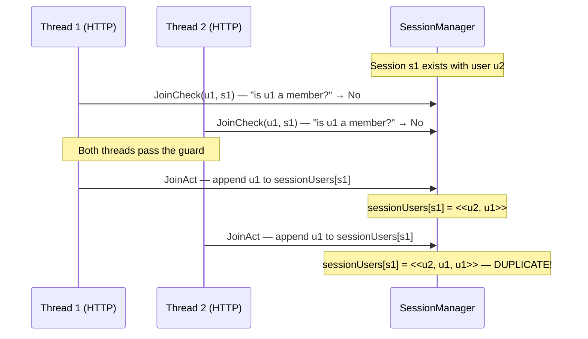
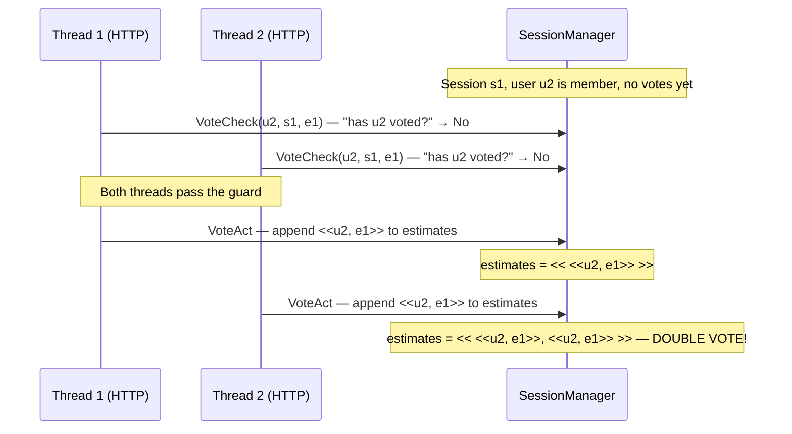
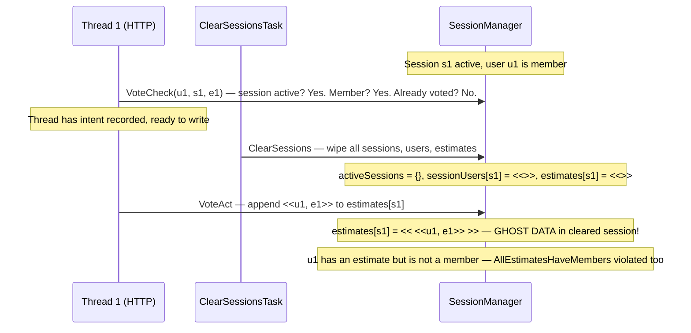

# Planning Poker — TLC Violation Traces

## 1. Double-Join TOCTOU Race (NoDuplicateUsername violated)

Two HTTP threads simultaneously try to join the same user to a session. Both pass the "not already a member" check before either writes, resulting in the username appearing twice.

## 2. Double-Vote TOCTOU Race (NoDoubleVote violated)

Two HTTP threads simultaneously submit a vote for the same user. Both pass the "hasn't voted yet" check before either writes, resulting in two estimates for one user.

## 3. Ghost Data After Session Clear (ClearedSessionsAreEmpty + AllEstimatesHaveMembers violated)

A thread passes the membership/session-active check, then the weekly cron wipes all sessions, then the thread completes its write — leaving orphaned data in a cleared session.

